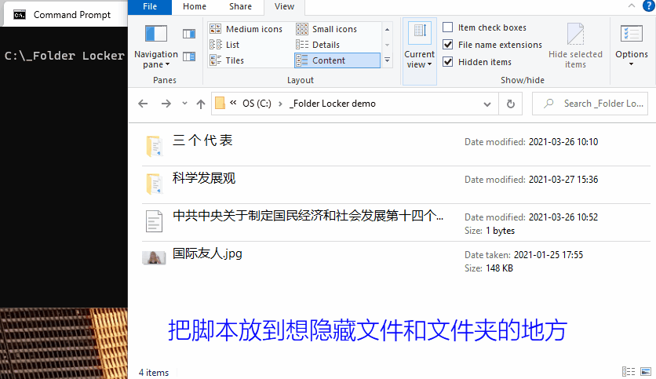
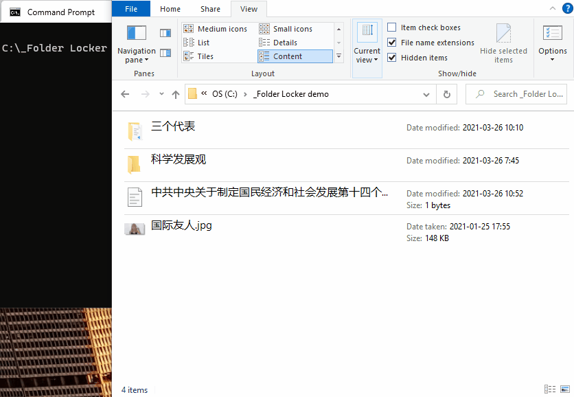
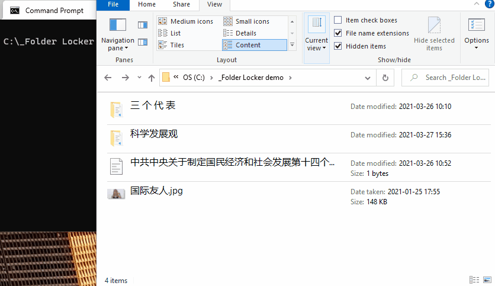

# Hide and Lock Files and Folders

## Windows

Usage: Download the stand-alone batch script [`.toggle_secret_files.bat`](windows_batch_script/.toggle_secret_files.bat) and put it where you want to hide files and folders. See its header for details.

### Functionality overview

### Basic usage

### Intermediate usage

### Advanced usage

Since this is my first batch script, I'm learning by doing along the way, and have left lots of comments in the script. Feel free to reduce the length of the script by removing the comments.

## Mac

TBD
